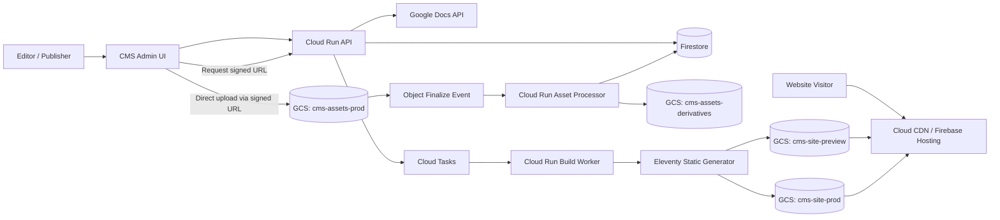
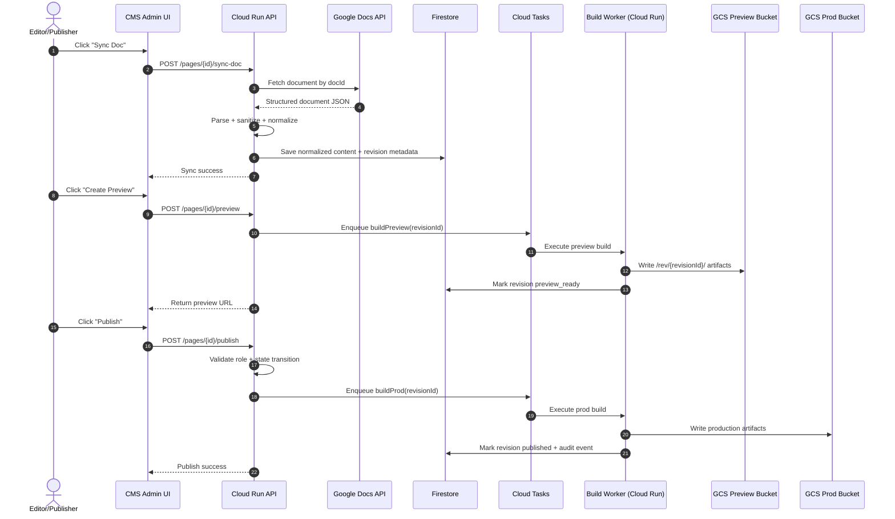
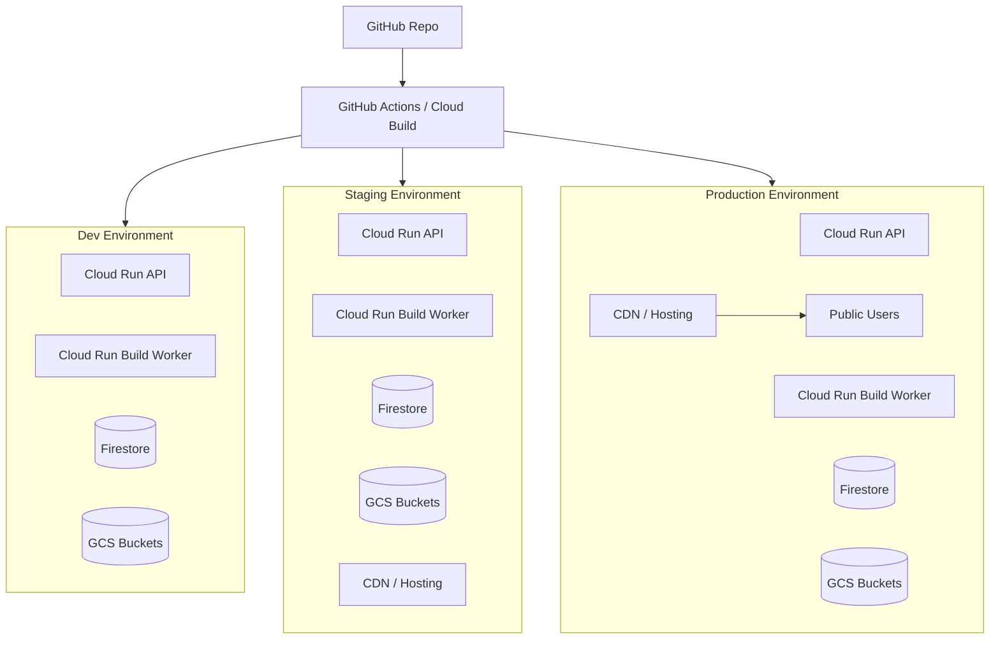
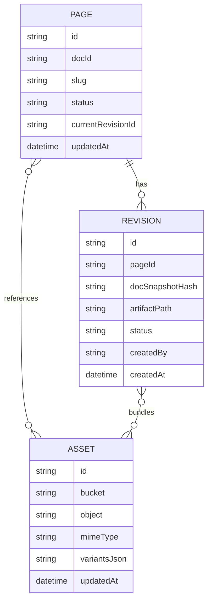
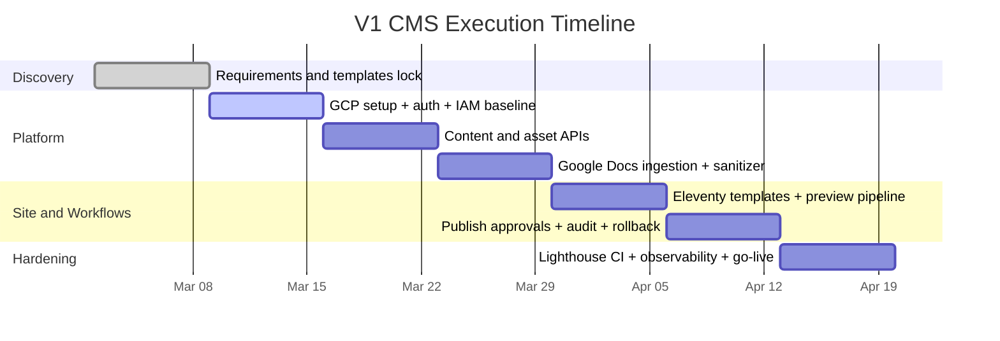

# CMS Architecture Diagrams (V1)

This document provides a diagrammatic view of the technical architecture and implementation approach described in `TECHNICAL_DESIGN.md`.

---

## 1) System Context and Core Components

---

## 2) Content Lifecycle: Draft -> Preview -> Publish

---

## 3) Deployment Topology (Dev / Staging / Prod)

---

## 4) Data Model Relationships

---

## 5) V1 Delivery Timeline (7 Weeks)

---

## 6) Architectural Approach (Summary)

1. Keep authoring simple with Google Docs.
2. Keep runtime minimal by publishing static site artifacts.
3. Keep operations light with serverless managed GCP components.
4. Keep performance high using strict budgets and Lighthouse gates.
5. Keep governance safe with revisioned previews, approvals, and audit logging.

